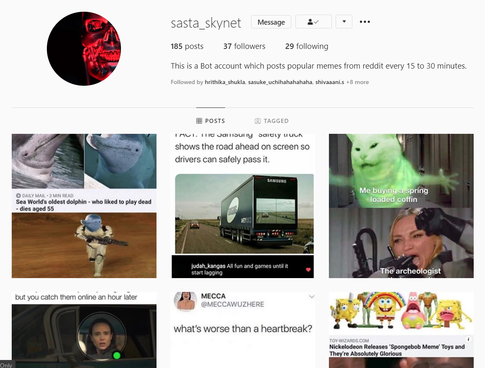

<!-- PROJECT SHIELDS -->

[![Contributors][contributors-shield]][contributors-url]
[![Forks][forks-shield]][forks-url]
[![Stargazers][stars-shield]][stars-url]
[![Issues][issues-shield]][issues-url]
[![Last Commit][last-activity-shield]][last-activity-url]  
[![LinkedIn][linkedin-shield]][linkedin-url]
<!--[![MIT License][license-shield]][license-url]-->

<!-- PROJECT LOGO -->
 

  

  <h3 align="center">Instagram Bot</h3>

  

    An automated bot that looks for memes on <a href = "https://www.reddit.com/">Reddit<a/> and uploads them on instagram.
    <!-- 
    <a href="https://github.com/reubence/Instagram-Bot"><strong>Explore the docs »</strong></a> -->
     
     
    <a href="https://www.instagram.com/sasta_skynet/?hl=en">View Bot</a>
    ·
    <a href="https://github.com/reubence/Instagram-Bot/issues">Report Bug</a>
    ·
    <a href="https://github.com/reubence/Instagram-Bot/issues">Request Feature</a>
  

<!-- TABLE OF CONTENTS -->
## Table of Contents

* [About this Project](#about-the-project)
	* [Built With](#built-with)
* [Roadmap](#roadmap)
* [Contributing](#contributing)<!--* [License](#license)-->
* [Contact](#contact)
* [Acknowledgements](#acknowledgements)

<!-- ABOUT THE PROJECT -->
## About The Project

  
 <h5 align="center">A Snapshot of the Instagram Page</h5>
  

So, I gotta be honest, this was more of an experiment and I wanted to see how long it takes for Instagram to detect and ban my bot because I was posting in 15-minuite intervals. The results you ask? It took Instagram about 28 hours to detect some kind of Hate Speech in my captions (I'm guessing somebody reported the account) after which it blocked my bot from posting captions for pictures. But apart from that my bot didn't get banned as such even after 3 days of posting continuously.

Talking about the Bot, it basically comes down to this : A web scrapinig script hosted on heroku which runs 24/7 and looks for memes from <a href="https://www.reddit.com/r/memes/">r/memes<a/> and posts them on Instagram every 15-minutes.

### Built With

* [Heroku](https://heroku.com/)
* [instabot](https://pypi.org/project/instabot/)
* [praw](https://praw.readthedocs.io/en/latest/)

<!-- ROADMAP -->
## Roadmap

See the [open issues](https://github.com/othneildrew/Best-README-Template/issues) for a list of proposed features (and known issues).

### Future Scope
List of features that can be added :

* NLP Caption Generator
* Simulating engagement on Instagram by liking, following and commenting on other people's posts.

<!-- CONTRIBUTING -->
## Contributing

Contributions are what make the open source community such an amazing place to be, learn, inspire, and create. Any contributions you make are **greatly appreciated**.

1. Fork the Project
2. Create your Feature Branch (`git checkout -b feature/AmazingFeature`)
3. Commit your Changes (`git commit -m 'Add some AmazingFeature'`)
4. Push to the Branch (`git push origin feature/AmazingFeature`)
5. Open a Pull Request

<!-- LICENSE 
## License

Distributed under the MIT License. See `LICENSE` for more information.
-->

<!-- CONTACT -->
## Contact

Reuben Rapose - [LinkedIn](https://www.linkedin.com/in/reubence/) - reuben.rapose@gmail.com

Project Link: [https://github.com/reubence/Instagram-Bot](https://github.com/reubence/Instagram-Bot)

<!-- ACKNOWLEDGEMENTS -->
## Acknowledgements
* [Heroku](https://heroku.com/)
* [GitHub Emoji Cheat Sheet](https://www.webpagefx.com/tools/emoji-cheat-sheet)
* [Img Shields](https://shields.io)
<!--* [Choose an Open Source License](https://choosealicense.com)
* [GitHub Pages](https://pages.github.com)
* [Animate.css](https://daneden.github.io/animate.css)
* [Loaders.css](https://connoratherton.com/loaders)
* [Slick Carousel](https://kenwheeler.github.io/slick)
* [Smooth Scroll](https://github.com/cferdinandi/smooth-scroll)
* [Sticky Kit](http://leafo.net/sticky-kit)
* [JVectorMap](http://jvectormap.com)
* [Font Awesome](https://fontawesome.com)-->

<!-- MARKDOWN LINKS & IMAGES -->
<!-- https://www.markdownguide.org/basic-syntax/#reference-style-links -->
[last-activity-shield]: https://img.shields.io/github/last-commit/reubence/Instagram-Bot?style=flat-square
[last-activity-url]: https://github.com/reubence
[contributors-shield]: https://img.shields.io/github/contributors/reubence/Instagram-Bot.svg?style=flat-square
[contributors-url]: https://github.com/reubence
[forks-shield]: https://img.shields.io/github/forks/reubence/Instagram-Bot.svg?style=flat-square
[forks-url]: https://github.com/reubence/Instagram-Bot/network/members
[stars-shield]: https://img.shields.io/github/stars/reubence/Instagram-Bot.svg?style=flat-square
[stars-url]: https://github.com/reubence/heroku-template/stargazers
[issues-shield]: https://img.shields.io/github/issues/reubence/Instagram-Bot.svg?style=flat-square
[issues-url]: https://github.com/reubence/heroku-template/issues
[license-shield]: https://img.shields.io/github/license/reubence/Instagram-Bot.svg?style=flat-square
[license-url]: https://github.com/reubence/Instagram-Bot/blob/master/LICENSE.txt
[linkedin-shield]: https://img.shields.io/badge/-LinkedIn-black.svg?style=flat-square&logo=linkedin&colorB=555
[linkedin-url]: https://www.linkedin.com/in/reubence/
[product-screenshot]: https://lh3.googleusercontent.com/proxy/l3Fi5jqPd6axyq2qRIgC_LqGaQgY4TplQuqMBctQlzhH2wEidEIbA2BNpVOrSC7idwzDB6G_pm-tLvZMbJa6BVznty5hQH7XlSWe4XjbHO_tAgO7H7o4-3IUERI6Kqgs